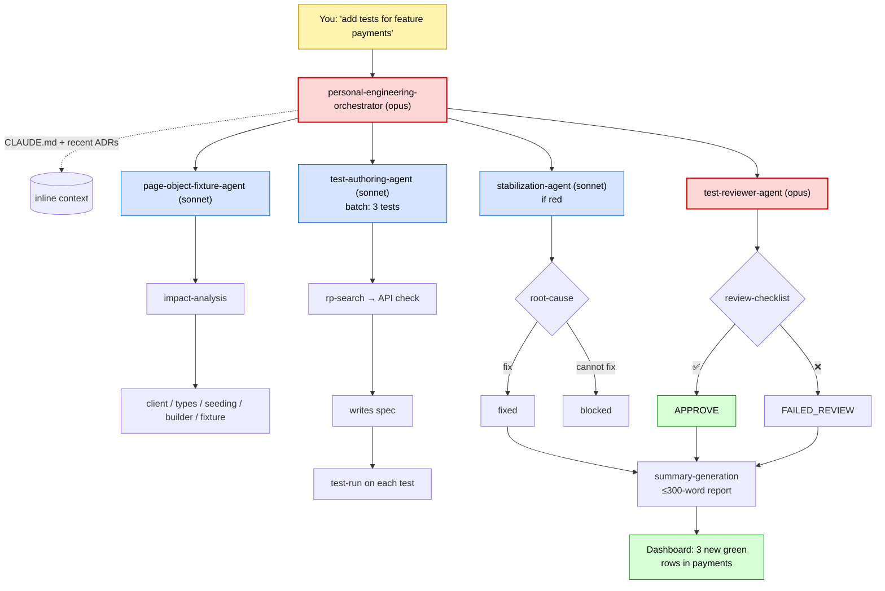

# `.claude/` — Agentic system for `playwright-e2e/`

Local, project-scoped agentic system that drives the migration of the legacy RemotePass test suite into this feature-first Playwright framework. Built on:

- **9 sub-agents** (`agents/`) — orchestrator + 8 specialists, tiered across Opus / Sonnet / Haiku.
- **6 skills** (`skills/`) — reusable procedures (Graphify, review, summary, test-run, impact analysis, clarification-protocol).
- **Live dashboard** (`../docs/test-migration/dashboard/`) — Streamlit on `http://localhost:8501`, reads JSON state files.
- **Migration record** (`../docs/test-migration/`) — `inventory.json` + `progress.json`, frozen history of the completed migration, committed to git.

Companion documents:

- `../GUARDRAILS.md` — hard prohibitions, mandatory gates, high-risk operations requiring HITL approval. Every agent reads this before acting.
- `../docs/_meta/memory-rules.md` — memory governance (English-only team memory; no leaks from legacy framework).
- `../docs/10-architecture/overview.md` — architecture patterns (ISTQB 3-layer, API composition via `seeding.ts`, Builder, Fixture incl. factory state-fixtures, POM v4 with DI, API Client, Config). No Flow/Facade layer.
- `../docs/20-engineering/composition-patterns.md` — `mergeTests`, factory state-fixtures, owner-feature seeding rule.
- `../docs/30-decisions/2026-05-27-hitl-protocol-for-agentic-migration.md` — five HITL checkpoints (CP-1…CP-5), phased rollout.

---

## Model tiering

| Tier | Model | Used by |
|---|---|---|
| Architect | `opus` | `personal-engineering-orchestrator`, `qa-architect`, `test-reviewer` |
| Worker | `sonnet` | `repo-intelligence`, `test-authoring`, `page-object-fixture`, `stabilization` |
| Utility | `haiku` | `docs-knowledge`, `english-explanation` |

Orchestrator always picks the minimum tier capable of the job. Escalation to Opus must be justified in the activity log.

## Cross-cutting rules (must apply in every agent)

1. **Graphify-gate (G5, discovery-before-edit).** Touching legacy code or shared abstractions → `mcp__graphify__query_graph` / `get_node` / `get_neighbors` or CLI `graphify affected "Symbol"` (or skill `graphify-query`), then Grep cross-check of the caller list. One graph spans code + docs/ team memory. Verification of edits = `tsc --noEmit` + affected tests (automatic gates G1–G3), not a graph call.
2. **API-spec-gate.** Before writing/updating `client.ts`, `types.ts`, or an API spec → `rp-search` / `rp-show` to verify endpoint shape. No guessing.
3. **Worktree isolation.** 1 agent = 1 worktree = 1 branch = 1 PR. Shared-infra edits serialised by the orchestrator. See `../docs/20-engineering/git-worktree-multi-agent.md`.
4. **Token-efficient delegation.** Orchestrator passes file paths and IDs, not contents. Workers return ≤300-word summaries via `summary-generation`.
5. **No memory pollution.** Team memory in `../docs/` is English-only and project-scoped. No legacy-framework decisions; no personal items. Capture is done by the personal `/rp-memory` skill (`~/.claude/skills/`), not an in-repo gate.
6. **Project scope.** Writes happen only inside `playwright-e2e/`. The graph reads the whole monorepo, but edits land here.
7. **HITL-gate.** Semi-autonomous mode (2026-06-23): only **CP-5 (Push/PR Authorization)** is active. **CP-3 removed** — the orchestrator self-selects 3–5 test batches per the approved plan and logs each to `dashboard/state/activity.jsonl`; the deterministic gates (G2 `tsc`, `lint:arch`, G3 tests) + G8 batch cap are the safety net. CP-1/CP-2/CP-4 deferred. HITL questions use the `clarification-protocol` skill. See `../GUARDRAILS.md` §3.

## Entry points

**Authoring a batch:**
```
You: "add tests for feature <feature>"
→ personal-engineering-orchestrator (Opus)
  → reads CLAUDE.md + recent ADRs for context
  → page-object-fixture (missing abstractions)
  → test-authoring (batch of 3–5, authors specs)
  → stabilization · test-reviewer
```

**Resume:**
```
You: "continue on <feature>"
→ orchestrator reads recent activity + repo state → picks up where it left off.
```

## End-to-end flow of one batch

The diagram below shows how a single user instruction ("add tests for feature payments") fans out across the agentic system and lands as concrete green rows on the dashboard. Opus tiers are red, Sonnet tiers are blue.



## Agent index

See `agents/<name>.md` — every file has `name | description | model | tools` in YAML frontmatter.

## Skill index

See `skills/<name>.md` — invoked by agents via Skill tool or referenced by procedure.

## Verifying the system

```bash
# 1) Files exist
ls .claude/agents/ .claude/skills/

# 2) JSON state parses
python3 -c "import json; [json.load(open(f)) for f in ['docs/test-migration/inventory.json','docs/test-migration/progress.json']]"

# 3) Dashboard runs
cd docs/test-migration/dashboard && source .venv/bin/activate && streamlit run app.py
```
