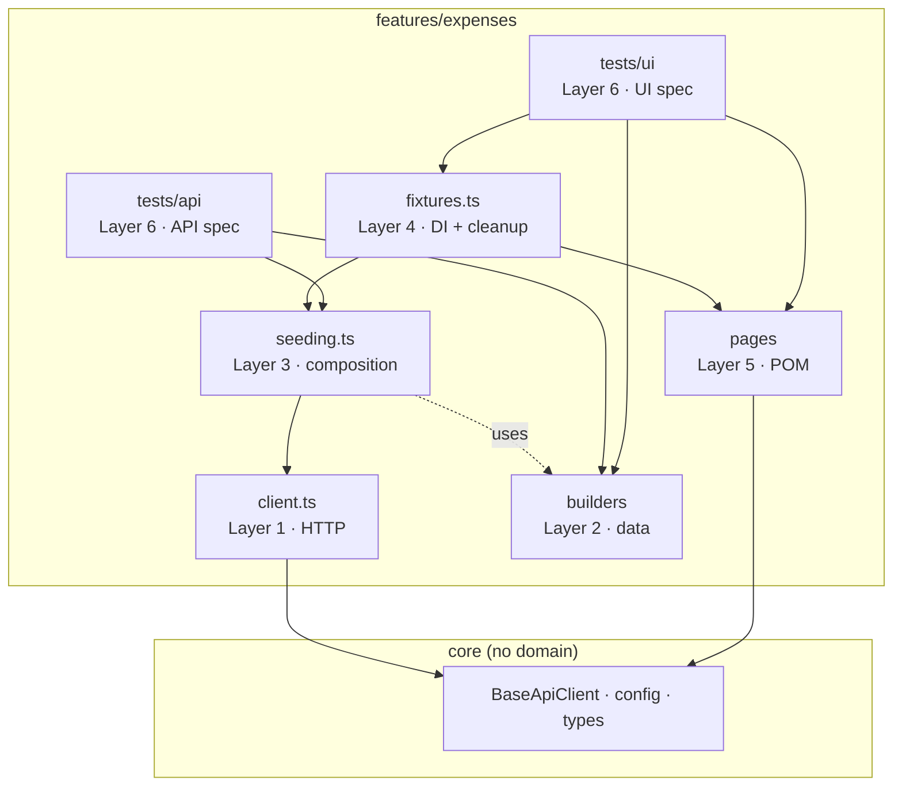
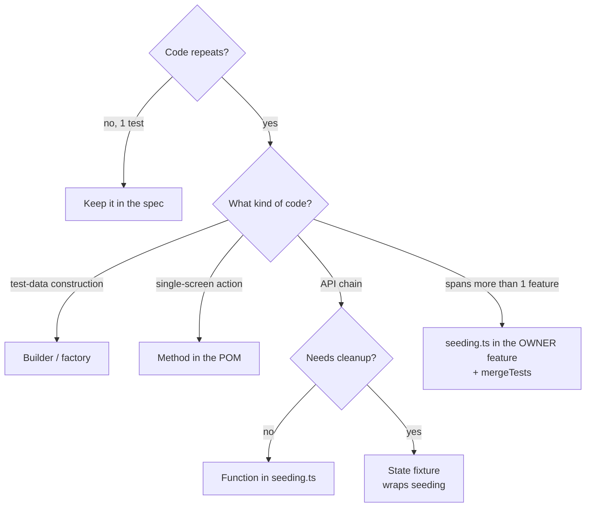
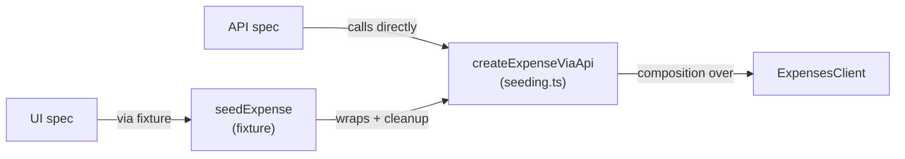
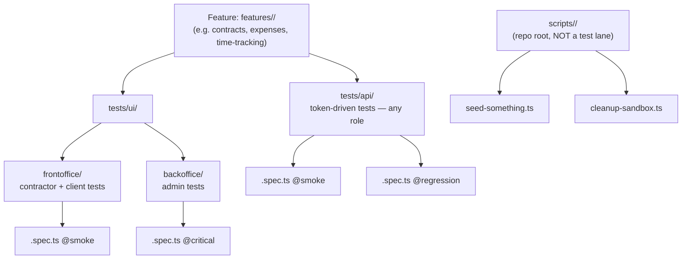
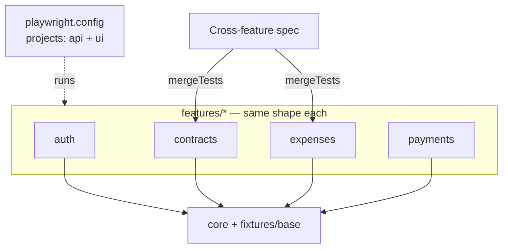

# Architecture Diagram: remotepass-qa

> **Feature keying:** every `features/<X>/` in the diagrams is a **user-facing feature** (`auth`, `contracts`, `payments`, `time-tracking`, …), never a backend microservice. See [`30-decisions/2026-05-22-dmytro-feature-first-layout.md`](../30-decisions/2026-05-22-dmytro-feature-first-layout.md) for the feature-first vs layer-first decision, and [`30-decisions/2026-05-25-dmytro-feature-over-microservice-division.md`](../30-decisions/2026-05-25-dmytro-feature-over-microservice-division.md) for the feature-vs-microservice rule.

> **No Flow/Facade layer.** Multi-step API composition lives in stateless `seeding.ts` helpers; reusable preconditions with lifecycle live in factory state-fixtures; Pages are injected via fixtures (DI); cross-feature tests combine fixtures with `mergeTests`. See [`30-decisions/2026-06-17-dmytro-remove-flow-facade-layers.md`](../30-decisions/2026-06-17-dmytro-remove-flow-facade-layers.md).

## Layers and reuse (dependencies point downward)

Arrows go only downward. The more arrows converge on a brick, the more it is reused — `client` and `seeding` are the main reuse points.

---

## Where repeated code goes — DRY routing

When code repeats, run it through this funnel. This is the maintenance rule: there is no Flow — reusable API chains go to `seeding.ts`.

---

## One seeding helper across API and UI (no duplication)

A single `seeding.ts` helper serves both test types: API specs call it directly; UI specs go through a factory state-fixture that wraps it and adds cleanup.

---

## Feature Structure (API vs UI + role split)

> `<feature>` is always a **user-facing capability**, never a backend microservice — see [`30-decisions/2026-05-25-dmytro-feature-over-microservice-division.md`](../30-decisions/2026-05-25-dmytro-feature-over-microservice-division.md).
> Selective runs are done via test tags (`--grep @smoke`) and Playwright projects (`--project=api`), not via separate folders. Standalone `npx tsx` utilities live in repo-root `scripts/`, not under `tests/`.

---

## Scaling to N features

Every feature has the same shape (Client / Builder / seeding / Pages / Fixtures / Tests). Cross-feature tests compose fixtures with `mergeTests`. One runner runs everything.

**No existing file is modified when adding a new feature** — a new `features/<feature>/` folder owns all its layers, and cross-feature tests reach it via `mergeTests`.
