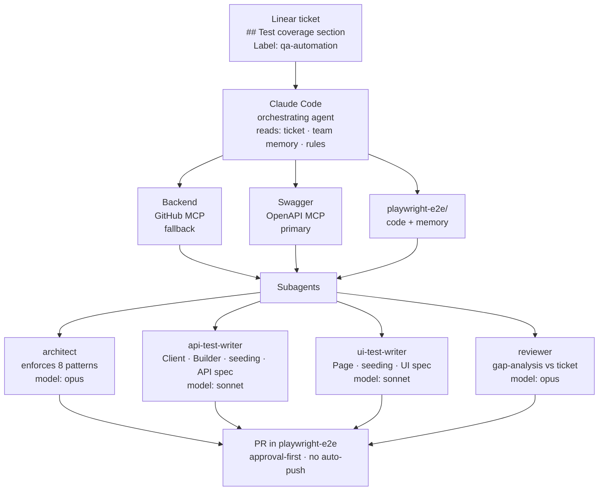

> ## 📍 When to read this document
>
> **You do not need to read this now.** This is a Phase 3 draft referenced from [migration-plan.md](migration-plan.md).
>
> | Phase | What we are doing | Status |
> |-------|------------------|--------|
> | Phase 0 | Documentation + memory system | ✅ Done |
> | Phase 1 | Foundation: config, BaseAPI, fixtures, CI | 🚧 In progress |
> | Phase 2 | Module-by-module migration, priority-driven | ⏳ After Phase 1 |
> | **Phase 3** | **AI-driven test generation — this document** | ⏳ After Phase 2 |
>
> This document was written early to capture the idea while the architecture was fresh.
> It will be refined and approved by the team during Phase 3.
> Track progress in the [Linear project](https://linear.app/remotep/project/playwright-e2e-framework-rewrite-and-migration-from-test-framework-be288bcf74f3).

# Integration Plan — AI-Driven Test Generation (DRAFT)

> ⚠️ **DRAFT — under team discussion. This is an example / proposal, not yet an approved decision.**
> Do not act on this document until the team explicitly accepts it. It exists to seed the discussion.

## Goal

Make AI agents produce ready-to-review tests from a Linear ticket — automatically:

1. Read the ticket and its "what to cover" section.
2. Consult the backend contract (Swagger first, GitHub MCP as fallback) and the frontend (Playwright MCP).
3. Respect the target architecture of `playwright-e2e/` (the 8 patterns, single config with `projects[]`).
4. Generate code into the correct module folder, following all layer contracts (Client → Builder → seeding → Page → Fixture → Test).

## What is already in place

- Team memory under `playwright-e2e/docs/` (architecture, decisions, domain, work-log).
- `/rp-memory` skill — file-per-record, auto-generated MEMORY.md index, approval-first.
- `/claude-finish` skill — push + PR flow.
- Target architecture is documented in `overview.md`, `diagram.md`, `plan.md`.
- Rule: memory descriptions must never lose knowledge on update.

## Target system at a glance

## Steps

### Step 1. Linear as the ticket and test-case source *(0.5 day)*

- Linear MCP is already available (`mcp__claude_ai_Linear__*`). Verify every engineer has it enabled (`claude mcp list`).
- Agree on the format of the coverage field:
  - A `## Test coverage` section in the ticket description listing scenarios in free form (not formal steps).
  - A `qa-automation` label on the ticket → signal that the ticket is in scope for auto-generation.
- Record the agreement in `30-decisions/`.

**Verify:** `mcp__claude_ai_Linear__get_issue` returns a real ticket with the `## Test coverage` section.

### Step 2. Backend context — Swagger primary, GitHub fallback *(1 day)*

**Recommendation:** Swagger first, GitHub MCP only when the contract is not enough.

Why:
- Swagger is compact → fits in the agent's context or indexes cleanly into RAG later.
- Swagger is up-to-date by contract (if backend CI publishes it). Backend source has implementation noise that is not needed to write API tests.
- GitHub is only needed when validation logic or side-effects are not visible in the contract.

Tasks:
1. Ask the backend team where the live OpenAPI/Swagger is published and whether CI publishes it. If not, ask for at least a weekly export to S3 or a repo.
2. Add a reference entry under `40-domain/` pointing to it.
3. Local mirror at `playwright-e2e/swagger/openapi.json` (gitignored), refreshed by `npm run sync-swagger`.
4. Optional: hook up an OpenAPI MCP so the agent calls `get_endpoint(path, method)` instead of reading the whole file.

GitHub MCP stays enabled for deep research.

**Verify:** ask Claude to describe a specific endpoint contract — it should answer from Swagger without reading backend source.

### Step 3. Four subagents under `.claude/agents/` *(1 day)*

Not one general writer — four specialists. Each sees only the context it needs → higher quality, fewer tokens.

Create in `playwright-e2e/.claude/agents/`:

| File | Role | Tools | Model |
|---|---|---|---|
| `architect.md` | Enforces the 8 patterns, layer contracts, naming, single config | Read, Grep, Glob (no Edit/Write) | opus |
| `api-test-writer.md` | Writes Client + Builder + seeding + API spec | Read, Edit, Write, Bash, Linear MCP, Swagger | sonnet |
| `ui-test-writer.md` | Writes Page Object + seeding + UI spec | Read, Edit, Write, Bash, Playwright MCP | sonnet |
| `reviewer.md` | Gap-analysis: compares PR against ticket | Read, Grep, Linear MCP | opus |

Each file declares `description` (when it is invoked), `tools` (what it may use), and `model`.

**Verify:** `Agent(subagent_type: "architect", prompt: "...")` resolves to this agent.

### Step 4. `/generate-test` skill — the entry point *(1–2 days)*

Engineer types `/generate-test LIN-123` → gets a draft PR with tests.

Live under `playwright-e2e/docs/60-skills/generate-test/SKILL.md`. Logic:

1. Read the ticket from Linear by id.
2. Read `playwright-e2e/docs/MEMORY.md` (team memory).
3. Detect the module (`time-tracking`, `payments`, `contracts`, …) from the ticket labels — or ask.
4. Read the existing module code (`clients/modules/{module}/`, `features/<feature>/seeding.ts`, `tests/modules/{module}/`).
5. Read Swagger for the touched endpoints.
6. Chain the subagents:
   - `api-test-writer` → create or update Client + Builder + seeding + spec.
   - if the ticket has UI scenarios → `ui-test-writer`.
   - `architect` → if violations are found, feed them back to the writer and regenerate.
   - `reviewer` → gap-analysis against the ticket.
7. Show the diff → approval-first → commit on `auto/LIN-123-<slug>`.
8. **Do not push.** Push is done via `/claude-finish` or manually.

Installed via the existing `npm run install-skills` mechanism.

**Verify:** for one simple ticket the skill produces a green spec in one pass.

### Step 5. Architect as pre-commit + GitHub Action *(0.5 day)*

The architecture rules must hold for hand-written PRs too, not only AI-generated ones.

- Pre-commit (lint-staged + ESLint):
  - No `import` from `tests/` into `clients/`.
  - `pages/` does not import `clients/` directly — only via `flows/`.
  - Nothing except `core/config/env.ts` reads `process.env`.
  - No files outside the 8 top-level folders.
- GitHub Action `architecture-check.yml`:
  - On every PR runs the `architect` subagent through `claude --headless` (or equivalent).
  - Posts findings as a PR comment.

**Verify:** a PR that imports `clients/` from `pages/` fails CI.

### Step 6. Memory + AI as a closed loop *(continuous)*

- Every meeting and architectural decision → `/rp-memory` → committed on `ai-memory-DD.MM.YY`.
- Every review feedback on an AI-generated PR — if it is a generalisable rule, write it to `30-decisions/`.
- Once per sprint: walk through `MEMORY.md`, retire stale entries, merge duplicates.

### Step 7. Migrate `test-framework/` → `playwright-e2e/` *(2–3 weeks, staged)*

Do not migrate everything at once. Move module by module, in business priority order.

1. **Freeze** `test-framework/` — no new tests there. Record the freeze in `30-decisions/`.
2. **Skeleton** `playwright-e2e/` per `docs/10-architecture/plan.md`:
   - `core/`, `clients/`, `builders/`, `flows/`, `pages/`, `fixtures/`, `tests/modules/`, `scripts/`
   - `playwright.config.ts` with `projects: [api, frontoffice, backoffice]`
   - `tsconfig.json` with path aliases
   - One reference module (`auth`) fully written in the new architecture — the team and the AI learn from it.
3. **Module-by-module migration** (≈ one module per week):
   - time-tracking (already a reference in the old framework → rewrite into the new architecture)
   - payments (team's hot priority)
   - contracts
   - company-settings
   - integration-setup seeders → move under `scripts/`, not specs
4. **For each module:**
   - `/generate-test` on a Linear ticket covering the existing scenario.
   - Compare with the old spec — keep what AI does better, lift what is missing, finish the spec.
   - Delete the old spec from `test-framework/`.
5. **When the last module is migrated:** delete `test-framework/`, keep a tag/branch for history.

**Module-ready criterion:** all `@smoke` green in CI on `playwright-e2e/`, no duplicates left in `test-framework/`.

## Critical files to prepare

| Path | Purpose |
|---|---|
| `playwright-e2e/.claude/agents/architect.md` | Subagent: enforce 8 patterns |
| `playwright-e2e/.claude/agents/api-test-writer.md` | Subagent: API specs |
| `playwright-e2e/.claude/agents/ui-test-writer.md` | Subagent: UI specs |
| `playwright-e2e/.claude/agents/reviewer.md` | Subagent: gap-analysis |
| `playwright-e2e/docs/60-skills/generate-test/SKILL.md` | Entry-point skill |
| `playwright-e2e/swagger/sync.ts` | npm script to refresh Swagger |
| `.github/workflows/architecture-check.yml` | CI architecture gate |
| `playwright-e2e/docs/30-decisions/…-linear-test-coverage-format.md` | Format of "what to cover" in Linear |
| `playwright-e2e/docs/30-decisions/…-freeze-old-test-framework.md` | Freeze decision for the old repo |

## End-to-end verification

1. Take ticket `LIN-XYZ` in Linear with a `## Test coverage` section and the `qa-automation` label.
2. Engineer in IDE: `/generate-test LIN-XYZ`.
3. Within 3–5 minutes they get a draft PR with:
   - New Client / Builder / seeding in the correct folders.
   - A spec file in `tests/modules/{module}/api/` or `ui/...`.
   - `architecture-check` CI green.
   - `@smoke` green.
4. PR carries a `reviewer` comment: "Covered 4 of 5 scenarios from the ticket. Missing scenario X."
5. Engineer reviews, completes the spec, merges.

## Anti-patterns

- Do not feed the entire backend to the agent — it is noise. Swagger plus targeted GitHub MCP queries on demand.
- Do not build one universal test-writer agent. The API/UI/architect/reviewer split is what produces quality.
- Do not migrate modules "a little bit at a time" across the board — move them whole.
- Do not push from the AI automatically. Approval-first stays the base rule.
- Do not record old `test-framework/` decisions into team memory. Team memory is scoped to the new framework.

## One-sentence summary

Linear feeds tickets, Swagger feeds the API contract, GitHub MCP is the fallback, four subagents (architect / api-writer / ui-writer / reviewer) split the work, the `/generate-test` skill is the engineer's entry point, ESLint + CI defend the architecture, and the old framework is migrated module by module over 2–3 weeks.
