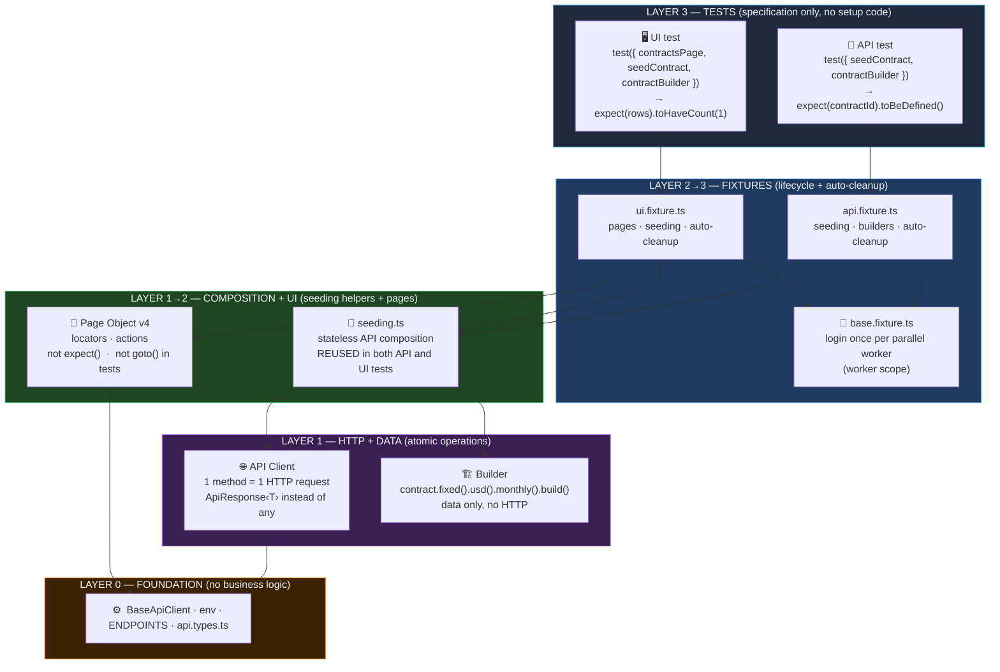

# remotepass-qa — Framework Architecture

> **Per-file responsibilities.** For what each file is for, where each kind of logic lives, and how to reuse without duplicating, see [`../20-engineering/layer-responsibilities.md`](../20-engineering/layer-responsibilities.md).

> **How code is organised.** Layers are conceptual (Tests → Fixtures → Page/seeding → Client/Builder → Core), but on disk the framework is **feature-first**: each feature owns its slice across all layers (`features/<feature>/{client,seeding,pages,builders,fixtures,tests}`). Features are user-facing capabilities (`auth`, `contracts`, `expenses`, …) — never backend microservices, even during the ongoing monolith → microservices migration. See [`30-decisions/2026-05-22-dmytro-feature-first-layout.md`](../30-decisions/2026-05-22-dmytro-feature-first-layout.md) (feature-first vs layer-first) and [`30-decisions/2026-05-25-dmytro-feature-over-microservice-division.md`](../30-decisions/2026-05-25-dmytro-feature-over-microservice-division.md) (feature-keyed, not service-keyed) for the rationale.

## One sentence per layer

| Layer | What it does |
|-------|-------------|
| **Tests** | Only declares required fixtures and contains `expect()` — no setup code |
| **Fixtures** | DI of pages/clients; factory state-fixtures seed preconditions and delete everything created after the test |
| **seeding** | Stateless helpers wrapping several client calls into one reusable sequence; reused by API specs *and* by fixtures for UI setup |
| **Page Object** | Encapsulates locators and actions; `expect()` — only in tests, `goto()` — only inside the page |
| **API Client** | One method = one HTTP request; typed `ApiResponse<T>` instead of `any` |
| **Builder** | Fluent test data creation without HTTP calls |
| **Core** | Technical foundation: HTTP mechanics, config, types — nothing about RemotePass |

## Patterns at a Glance

| Pattern | Lives in (feature-first layout) |
|---------|---------|
| ISTQB Three-Layer Architecture | `features/<feature>/{client,seeding,pages,tests}` — every feature owns all layers |
| API Composition | `features/<feature>/seeding.ts` — stateless helpers; reused by API specs and wrapped by factory fixtures (no Flow/Facade — see [2026-06-17 ADR](../30-decisions/2026-06-17-dmytro-remove-flow-facade-layers.md)) |
| Builder Pattern | `features/<feature>/builders/` |
| Fixture Pattern | `features/<feature>/fixtures.ts` (Playwright `test.extend()`, factory state-fixtures, `mergeTests`) + cross-cutting `fixtures/base.fixture.ts` |
| Page Object Model v4 | `features/<feature>/pages/{frontoffice,backoffice}/` — injected via fixtures (DI) |
| API Client Pattern | `features/<feature>/client.ts` (one file per backend boundary inside the feature — features that span multiple services hold multiple client files) |
| **Config Pattern** | `core/config/env.ts` — single typed entry point for env vars, no `process.env` elsewhere |
